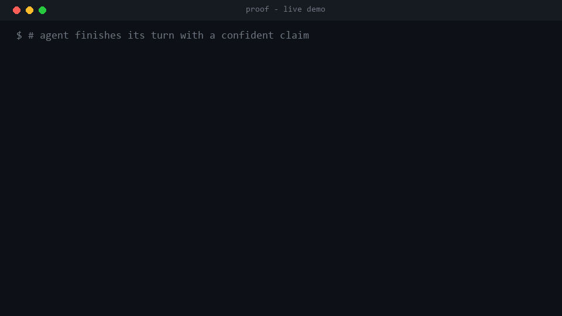

# Proof

[](https://github.com/EricFinland/proof/actions/workflows/ci.yml)
[](LICENSE)
[](https://www.python.org)

**Your coding agent can no longer say "done" without receipts.**

Proof is a [Claude Code](https://docs.claude.com/en/docs/claude-code) skill plus
Stop hook that auto-fact-checks an agent's completion claims. The moment the
agent says "tests pass" or "all done, it works", Proof fires an *independent*
verifier that runs the real checks and returns a strict
**PASS / FAIL / INCONCLUSIVE** verdict with the actual command output as evidence,
before the turn is allowed to end.

No configuration. No success criteria to write. Arm it once, then work normally.



## See it catch a lie

A repository whose tests are red. The agent claims they are green. Proof runs the
test suite itself and busts the claim:

```
1. The agent ends its turn with a claim:
   "All done, tests pass."

2. The Stop hook fires automatically and injects the verifier directive:
   decision: block
   reason:  PROOF: you just claimed work is complete. Do NOT stop. Spawn an
            INDEPENDENT verifier subagent that runs the real checks ...

3. The independent verifier runs the REAL check:
   FAIL
     FAIL tests: `python -m pytest -q`
   exit code: 1
```

And the receipt it writes to `proof-report.md`:

```
# Proof Report -- FAIL

## FAIL -- tests
- Claim:   All done, tests pass.
- Command: `python -m pytest -q`

    >   assert 1 == 2
    E   assert 1 == 2
    FAILED test_bad.py::test_bad - assert 1 == 2
    1 failed in 0.05s
```

### Caught in a real repo

This is not a contrived fixture. Pointed at a real project whose test
environment was silently broken, Proof caught that "all tests pass" was false:
the suite did not even import.

```
$ proof verify --transcript turn.jsonl --root .
FAIL
  FAIL tests: `python -m pytest -q`

  ERROR collecting tests/test_cli.py
  E   ModuleNotFoundError: No module named 'mcp_audit'
  exit code: 1
```

An agent that said "done, tests pass" there would have been wrong, and you would
have found out three steps later. Proof finds out immediately.

## Why this matters

Hallucinated completion is the biggest trust gap in agentic coding. The agent
grades its own homework, so "it works" is unreliable, and you find out by hand.
Proof breaks the loop: a separate verifier, in a fresh context, assumes every
claim may be false and trusts only execution output. One failed check fails the
whole turn.

## Install

One line, via the [skills CLI](https://github.com/vercel-labs/skills):

```bash
npx skills add EricFinland/proof
```

Or grab it directly and arm the hook yourself:

```bash
cd <your project>
python /path/to/proof/scripts/proof.py arm
```

Arming adds a `Stop` hook to your project's `.claude/settings.json`. Then work
as usual. Turn it off any time:

```bash
python /path/to/proof/scripts/proof.py disarm   # remove the hook
python /path/to/proof/scripts/proof.py status   # armed | disarmed
```

Run a check manually against any transcript:

```bash
python proof/scripts/proof.py verify --transcript <path> --root <repo>
# exit 0 = PASS, 1 = FAIL, 2 = INCONCLUSIVE
```

## How it works

1. The Stop hook (`proof_trigger.py`) reads Claude Code's hook payload and pulls
   the agent's last message.
2. A precision classifier checks it for completion-claim language. It is tuned
   against real-world traps ("I fixed a typo", "the done button is broken",
   "should work eventually") so it does not cry wolf.
3. On a fresh claim, the hook blocks the stop and injects a directive telling the
   agent to spawn an independent verifier subagent.
4. The verifier extracts the checkable assertions, runs the matching strategy,
   aggregates a strict verdict, and writes `proof-report.md`.
5. A per-session recursion guard verifies each distinct claim exactly once, so
   the verifier's own output can never trigger a loop.

## Verifier strategies

Proof maps each claim to a deterministic check. Missing tooling yields
INCONCLUSIVE, never a false PASS.

| Strategy | Verifies a claim like |
|----------|-----------------------|
| `tests` | "tests pass" (auto-detects pytest, npm, cargo, go) |
| `build` | "the build is clean" |
| `typecheck` | "types check" |
| `lint` | "lint is clean" |
| `command` | "running X works" |
| `http` | "GET /health returns 200" |
| `repro` | "the bug is fixed" (re-runs the original repro) |
| `filecheck` | "added function X to file Y" |

The strategy layer is pluggable. UI/browser and live-deploy verifiers are the
natural next additions.

## Design

- **Pure Python standard library.** No dependencies. Runs anywhere Python 3.11+ runs.
- **Adversarial by construction.** The verifier is told to distrust the claims and
  accept only execution artifacts.
- **Strict aggregation.** Any single failed claim fails the entire verdict.
- **Cross-platform.** Tested on Linux and Windows in CI.

Full design and contract docs live in
[`proof/references/`](proof/references). The skill manifest is
[`proof/SKILL.md`](proof/SKILL.md).

## Development

```bash
cd proof
python -m pytest -q
```

71 tests cover the classifier, claim extractor, every strategy, verdict
aggregation, the Stop hook's crash-safety and recursion guard, the installer,
and an end-to-end acceptance test that reproduces the demo above.

## License

MIT. See [LICENSE](LICENSE).
