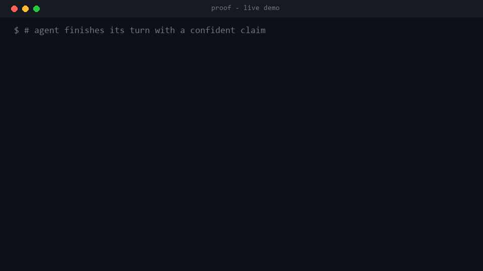

# Proof

[](https://github.com/EricFinland/proof/actions/workflows/ci.yml)
[](LICENSE)
[](https://www.python.org)

**Your coding agent can no longer say "done" without receipts.**

Proof is a [Claude Code](https://docs.claude.com/en/docs/claude-code) skill plus
Stop hook that auto-fact-checks an agent's completion claims. The moment the
agent says "tests pass" or "all done, it works", the hook runs the real checks
itself, looks at what actually changed, and returns a strict
**PASS / FAIL / SUSPECT / INCONCLUSIVE** verdict with the actual command output
as evidence, before the turn is allowed to end.

No configuration. No success criteria to write. Arm it once, then work normally.



## v3: receipts that can't be faked

v2 asked the agent to verify itself and report back. v3 stops trusting the agent
with any part of the loop.

- **The hook runs the checks itself.** Tests, build, and endpoints run inside
  the Stop hook under a time budget (90 seconds by default). A FAIL comes back
  inline with the receipt. A verifier subagent is only used for the leftovers,
  and the agent cannot skip it by stopping again.
- **SUSPECT catches gamed tests.** Green tests prove nothing if the agent skipped
  the failing one. Proof diffs the tree against a baseline taken when the session
  started and flags skipped, deleted, focused, and gutted tests, and test commands
  rigged to always pass.
- **Red-green fix receipts.** "I fixed the bug" has to be proven: the repro must
  fail on the session baseline and pass now.
- **Claim vs diff.** "I added `parse_price` to `pricing.py`" when neither changed,
  or "fixed" when only a comment changed, is SUSPECT.
- **CI mode.** `proof check "all tests pass" --since origin/main` runs the same
  checks over a whole branch.

### SUSPECT: a skipped test, caught

The suite is red. Instead of fixing the bug, the agent skips the failing test and
claims victory. The tests really do pass now, so a plain test run would say PASS.
Proof reads the diff:

```
$ proof check "All done, tests pass." --since HEAD
SUSPECT
  SUSPECT tamper: skip-added: tests/test_pricing.py:10  @pytest.mark.skip(reason="flaky on CI")
$ echo $?
3
```

In the Stop hook, the agent is blocked once and asked to revert or explain:

```
PROOF: the checks pass, but the change looks like it games them:

skip-added: tests/test_pricing.py:10  @pytest.mark.skip(reason="flaky on CI")

Revert these changes, or explain why each one is intentional. If they are
intentional, Proof will show them to the user instead of blocking again.
```

If the agent insists, Proof does not argue. It lets the turn end and puts the
findings in front of you:

```
Proof: SUSPECT. The agent was asked about these once and they remain. Please review:
skip-added: tests/test_pricing.py:10  @pytest.mark.skip(reason="flaky on CI")
```

You decide. The agent does not get to.

### Red-green: a fix, proven

The agent adds a regression test and changes the code. Proof copies the new test
into a temporary worktree of the session baseline and runs it there, then runs it
on the current tree. The receipt in `proof-report.md`:

```
## PASS -- redgreen
- Claim:   I fixed the bug: prices with thousands separators parse now, and all tests pass.
- Command: `python -m pytest -q tests/test_pricing.py`

    fix proven: repro failed before the change and passes now
    baseline output:
    E       ValueError: could not convert string to float: '1,200.50'
    FAILED tests/test_pricing.py::test_parse_commas - ValueError: could not conve...
    1 failed, 1 passed in 0.07s
```

A test that already passes on the baseline proves nothing, so that is SUSPECT:

```
SUSPECT
  SUSPECT redgreen: repro-already-green: tests/test_pricing.py  repro passes on the baseline without your change, so it does not prove the fix
```

No changed test? Proof also accepts `[repro].command` in `.proof.toml` or a
``Repro: `<command>` `` line in the claim, and asks for one when neither exists.

### Claim vs diff

```
$ proof check "I fixed the comma bug in \`pricing.py\`." --since HEAD
SUSPECT
  SUSPECT scope: docs-only: pricing.py  only documentation or comments changed
```

The scope rules are `empty-change` (claims a change, nothing changed),
`docs-only` (a fix that only touched docs or comments), `named-path-unchanged`,
and `named-symbol-missing` (a backticked file or identifier in an "added" or
"implemented" sentence that the diff does not contain).

## See it catch a lie

A repository whose tests are red. The agent claims they are green. Proof runs the
test suite itself and busts the claim:

```
1. The agent ends its turn with a claim:
   "All done, tests pass."

2. The Stop hook runs the real check inline and blocks with the receipt:
   decision: block
   reason:  PROOF: your completion claim did not survive verification
            (attempt 1 of 3).

            FAIL tests: `python -m pytest -q`
            E       assert 1 == 2
            FAILED test_bad.py::test_bad - assert 1 == 2
            1 failed in 0.05s

            Fix the failing checks, then claim completion again. Proof will
            re-verify automatically.

3. The agent fixes the code and claims again. Proof re-verifies. Only a PASS
   ends the loop.
```

And the receipt it writes to `proof-report.md`:

```
# Proof Report -- FAIL

## FAIL -- tests
- Claim:   All done, tests pass.
- Command: `python -m pytest -q`

    >   assert 1 == 2
    E   assert 1 == 2
    FAILED test_bad.py::test_bad - assert 1 == 2
    1 failed in 0.05s
```

### Caught in a real repo

This is not a contrived fixture. Pointed at a real project whose test
environment was silently broken, Proof caught that "all tests pass" was false:
the suite did not even import.

```
$ proof verify --transcript turn.jsonl --root .
FAIL
  FAIL tests: `python -m pytest -q`
```

The receipt in `proof-report.md`:

```
## FAIL -- tests
- Command: `python -m pytest -q`

    ERROR collecting tests/test_cli.py
    E   ModuleNotFoundError: No module named 'mcp_audit'
```

An agent that said "done, tests pass" there would have been wrong, and you would
have found out three steps later. Proof finds out immediately.

## Why this matters

Hallucinated completion is the biggest trust gap in agentic coding. The agent
grades its own homework, so "it works" is unreliable, and you find out by hand.
Worse, an agent under pressure to go green can make the tests pass without making
the code work. Proof breaks the loop: deterministic checks it runs itself, a diff
against where the session started, and no way for the agent to talk its way past
either. One failed check fails the whole turn.

## Install

One line, via the [skills CLI](https://github.com/vercel-labs/skills):

```bash
npx skills add EricFinland/proof
```

Or grab it directly and arm the hooks yourself:

```bash
cd <your project>
python /path/to/proof/scripts/proof.py arm
```

Arming adds two hooks to your project's `.claude/settings.json`: a
`SessionStart` hook that snapshots the repo when a session begins, and a `Stop`
hook that checks claims. Then work as usual. Turn it off any time:

```bash
python /path/to/proof/scripts/proof.py disarm   # remove both hooks
python /path/to/proof/scripts/proof.py status   # armed | disarmed
```

### Upgrading from v2

A v2 `Stop` hook keeps working after you update, but it has no `SessionStart`
hook (so diffs use an approximate `HEAD` baseline) and no hook timeout. Run
`proof arm` again in each project to replace it. `proof status` prints
`armed (v2 hook entry: run "proof arm" again to upgrade)` until you do.

Run a check manually against any transcript:

```bash
python proof/scripts/proof.py verify --transcript <path> --root <repo>
```

## Verdicts and exit codes

| Verdict | Exit | Meaning |
|---------|------|---------|
| PASS | 0 | No check failed or looked gamed, and at least one check passed. |
| FAIL | 1 | A check failed. The receipt is the command and its output. |
| INCONCLUSIVE | 2 | Nothing could be checked definitively (no runner, command not found, timed out). |
| SUSPECT | 3 | The checks pass, but the tests were gamed, the fix was never red, or the claim contradicts the diff. |

Severity when results combine: FAIL beats SUSPECT beats PASS beats INCONCLUSIVE.
Missing tooling yields INCONCLUSIVE, never a false PASS. Proof's own errors skip
an analysis with a note in the report; they never produce FAIL or SUSPECT.

## How it works

1. **SessionStart.** `proof_session_start.py` snapshots the working tree
   (tracked and untracked, minus anything git ignores) into a commit under
   `refs/proof/baseline/<session>`, using a temporary index. Your index and
   working tree are never touched. Baselines older than 7 days are pruned.
   Because the snapshot includes untracked files, those commits hold copies of
   them, and they show up in `git log --all` until pruned.
2. **Claim detection.** On Stop, `proof_trigger.py` pulls the agent's last
   message and runs a precision classifier. It is tuned against real-world traps
   ("I fixed a typo", "the done button is broken", "should work eventually") so
   it does not cry wolf.
3. **Inline run.** On a fresh claim, the hook runs the matching checks in-process
   under `inline_budget` seconds, then the diff analyzers against the baseline:
   tamper rules for tests and build claims, scope checks for change claims, and
   red-green for fix claims.
4. **Decide.**
   - PASS: the turn ends with a `Proof: PASS (tests)` message.
   - FAIL: the turn is blocked with the failing command and its output inline.
   - SUSPECT: blocked once with the findings. If the same findings come back,
     Proof stops blocking and shows them to you instead.
   - Anything that did not finish in the budget, or came back INCONCLUSIVE, is
     marked pending, and the hook asks for an independent verifier subagent to
     run `proof.py verify --claim-key ...` for just those checks.
5. **Pending enforcement.** If the agent stops again without running that
   verification, the hook blocks again with "verification was not run". Only
   `proof.py` can clear a pending check. Agent prose cannot.

Every block in one continuation chain counts toward `max_fix_cycles` (default 3),
so Proof can never trap the agent in an infinite loop.

## Verifier strategies

Proof maps each claim to a deterministic check. Missing tooling yields
INCONCLUSIVE, never a false PASS.

| Strategy | Verifies a claim like |
|----------|-----------------------|
| `tests` | "tests pass" (auto-detects runner by repo files) |
| `build` | "the build is clean" |
| `typecheck` | "types check" |
| `lint` | "lint is clean" |
| `http` | "GET /health returns 200", body assertions, boots local servers, verifies live deploy URLs |

On top of those, three diff analyzers compare the tree to the session baseline:

| Analyzer | Runs on | Catches |
|----------|---------|---------|
| `tamper` | tests and build claims | `test-file-deleted`, `test-removed`, `skip-added`, `only-added`, `assert-gutted`, `runner-neutered` |
| `scope` | change claims ("fixed", "added", "implemented") | `empty-change`, `docs-only`, `named-path-unchanged`, `named-symbol-missing` |
| `redgreen` | fix claims | a repro that was never red (`repro-already-green`), or a fix that still fails |

Every rule, with exactly what it matches and what it deliberately ignores, is in
[`proof/references/verifier-strategies.md`](proof/references/verifier-strategies.md).

## Runner support

Test and build runner auto-detection covers: Node/Bun/pnpm/yarn/npm
(by lockfile), Python/pytest, Rust/Cargo, Go, Maven, Gradle (wrapper preferred),
.NET (sln/csproj), Make (when a `test:` target exists), Elixir/Mix, PHP/Composer.

Red-green targets changed test files directly for pytest, go test, and JS
runners (jest, vitest, and npm/pnpm/yarn/bun test scripts). For anything else,
set `[repro].command`.

## HTTP verification

The `http` strategy handles three scenarios:

1. **Live URL in claim.** Makes an HTTP GET and checks the status code. Non-local
   URLs that are unreachable are treated as a failed deploy claim (FAIL, not
   INCONCLUSIVE).
2. **Local URL, server not running.** Boots a local server automatically using
   (in order): `[http].serve` from `.proof.toml`, then `package.json` `dev`/`start`
   script, then `Procfile` `web:` line. Polls for readiness up to 30 seconds,
   then tears down the process tree.
3. **Body assertion.** Claims containing `with "..."` or `containing "..."` (e.g.,
   `GET /health returns 200 with "ok"`) also check that the response body contains
   the expected substring.

## Fix loop

When verification fails, Proof does not let the agent walk away. It blocks the
turn with the failing receipts inline and a note reading "attempt N of MAX". The
agent fixes the code and claims again inside the same continuation chain, and
Proof re-verifies the new claim even if it is worded differently.

Every block in the chain counts: FAIL receipts, SUSPECT blocks, subagent
directives, and "verification was not run" re-blocks. After `max_fix_cycles`
blocks (default 3, override in `.proof.toml`), Proof lets the turn end so you are
not stuck in an infinite loop, and tells you the last verdict with its failing
checks or findings. The same happens when the agent stops without re-claiming
after a FAIL or SUSPECT block. A passing verdict ends the loop immediately.

A claim that passed is not re-run when the agent repeats it word for word,
unless the working tree changed since that pass (git repositories only). A new
turn never re-asks for a verifier the previous turn left pending.

## proof stats

Track the agent's honesty over time. Every `proof verify` and `proof check` run
appends an entry to `~/.proof/ledger.jsonl` (override with `PROOF_HOME`).

```
$ proof stats
Honesty rate: 68% (19 verified, 6 lies caught)
Gamed: 2
Clean streak: 3
Worst offender: tests (3 catches)
Last catch: "All done, tests pass." (2026-09-28)
```

`Gamed` counts SUSPECT verdicts. It shows up once the agent has been caught
gaming at least once.

Filter to recent runs:

```
$ proof stats --days 7
```

Machine-readable output for CI pipelines:

```
$ proof stats --json
```

## Works with any agent, and in CI

`proof check` verifies any claim text directly, without a transcript. Works from
CI or with any coding agent:

```bash
proof check "all tests pass and the build is clean" --root /repo --json
```

`--since <ref>` diffs against the merge-base of that ref and `HEAD` instead of
the session baseline, so the tamper and scope checks cover a whole branch, and a
branch that is behind the ref does not see the ref's newer commits as deletions.
A ref that does not resolve adds the note `could not resolve --since <ref>` and
skips the diff checks. In a pull request pipeline:

```yaml
- uses: actions/checkout@v4
  with:
    fetch-depth: 0          # --since needs origin/main in the clone
- run: python path/to/proof/scripts/proof.py check "all tests pass" --root . --since origin/main
```

A skipped test or a neutered test script fails the job with exit code 3, even
though the suite itself is green.

The `--json` flag emits a single JSON object with keys `overall`, `exit`,
`results`, and `report`. Each result carries `findings` (`rule`, `file`, `line`,
`snippet`). Pipe it into any CI assertion or notification webhook.

## .proof.toml reference

Place `.proof.toml` in your project root to override auto-detection.

| Key | What it does | Default |
|-----|-------------|---------|
| `[commands].test` | Test command used instead of auto-detected runner (singular key; `tests` is also accepted) | auto-detect |
| `[commands].build` | Build command used instead of auto-detected runner | auto-detect |
| `[commands].typecheck` | Typecheck command (no auto-detect; required to get a non-inconclusive verdict) | none |
| `[commands].lint` | Lint command (no auto-detect; required to get a non-inconclusive verdict) | none |
| `[http].base_url` | Base URL used for HTTP claims that contain no URL | none |
| `[http].serve` | Shell command to boot a local server for HTTP verification | auto-detect |
| `[verify].max_fix_cycles` | Maximum blocks in one continuation chain before Proof lets the turn end | `3` |
| `[verify].inline_budget` | Seconds the Stop hook spends on checks before deferring the rest to a verifier subagent (env `PROOF_INLINE_BUDGET` overrides) | `90` |
| `[verify].command_timeout` | Per-command timeout in seconds for `proof verify` and `proof check` | `600` |
| `[baseline].enabled` | Capture a git baseline on SessionStart | `true` |
| `[tamper].enabled` | Run the tamper rules | `true` |
| `[tamper].disable` | Tamper rule ids to turn off, e.g. `["test-removed"]` | `[]` |
| `[repro].command` | Explicit repro for fix claims; must fail on the baseline and pass now | `""` |

`arm` sets the Stop hook's timeout to `inline_budget + 30` seconds, so re-run it
after changing the budget.

Example:

```toml
[commands]
test = "pytest -x -q"
lint = "ruff check ."
typecheck = "mypy src"

[http]
base_url = "http://localhost:3000"
serve = "npm run dev"

[verify]
max_fix_cycles = 5
inline_budget = 120

[tamper]
disable = ["assert-gutted"]

[repro]
command = "pytest tests/test_regressions.py -q"
```

The full reference, with precedence rules, is in
[`proof/references/configuration.md`](proof/references/configuration.md).

## Limits

Proof is honest about where its checks stop.

- **Tamper rules are patterns, tuned for precision.** They catch the common ways
  to game a suite, and they are deliberately quiet on legitimate changes:
  conditional skips (`skipif`, `skipUnless`, `importorskip`) and `todo` are
  allowed, moved or renamed tests are netted out across the change, and a test
  deleted along with the feature it covered is fine. An agent that mocks out the
  code under test or rewrites an expected value will not trip them.
- **Scope checks read backticks.** Named files and symbols are taken from
  backticked tokens in sentences that say "added", "created", "implemented",
  "wrote", or "introduced". Prose claims are not parsed.
- **Red-green needs a runnable repro.** The baseline worktree gets
  `node_modules` linked in and `PYTHONPATH` set, which covers most projects.
  Compiled dependencies, monorepos, and exotic setups can come back
  INCONCLUSIVE; `[repro].command` is the override.
- **No baseline, fewer checks.** If Proof is armed mid-session it diffs against
  `HEAD`, marked approximate, and skips the scope and red-green checks. Outside a
  git repository, all three analyzers are skipped.
- **The cap is a cap.** After `max_fix_cycles` blocks Proof lets the turn end
  and shows you the last verdict. The report and ledger still record it.

## Design

- **Pure Python standard library.** No dependencies. Runs anywhere Python 3.11+ runs.
- **Deterministic receipts.** Every verdict comes from commands Proof ran and a
  diff it computed. Nothing depends on what the agent says it did.
- **Adversarial by construction.** The verifier subagent, when one is needed, is
  told to distrust the claims and accept only execution artifacts.
- **Strict aggregation.** Any single failed check fails the entire verdict, and
  a SUSPECT finding outranks any number of passes.
- **Hands off your tree.** Proof writes only temporary index files,
  `refs/proof/*`, temporary worktrees under `~/.proof/work`, and
  `proof-report.md` in the project root (or `--out-dir`). It never modifies your
  working tree or index.
- **State lives in `~/.proof`** (or `$PROOF_HOME`): `verified.json` for claim
  attempts and outcomes, `baselines/` for session baseline records,
  `ledger.jsonl` for `proof stats`, and `work/` for red-green worktrees.
- **Cross-platform.** Tested on Linux and Windows in CI.

Full design and contract docs live in
[`proof/references/`](proof/references). The skill manifest is
[`proof/SKILL.md`](proof/SKILL.md).

## Development

```bash
cd proof
python -m pytest -q
```

398 tests cover the classifier, claim extractor, every strategy, verdict
aggregation, the Stop hook's crash-safety, inline verification and pending
enforcement, session baselines and changesets, every tamper rule against
positive and negative corpora, the scope checks, red-green runs in real
temporary git repos, the ledger, the fix loop, the installer, and an end-to-end
acceptance test that reproduces the demo above.

## License

MIT. See [LICENSE](LICENSE).
